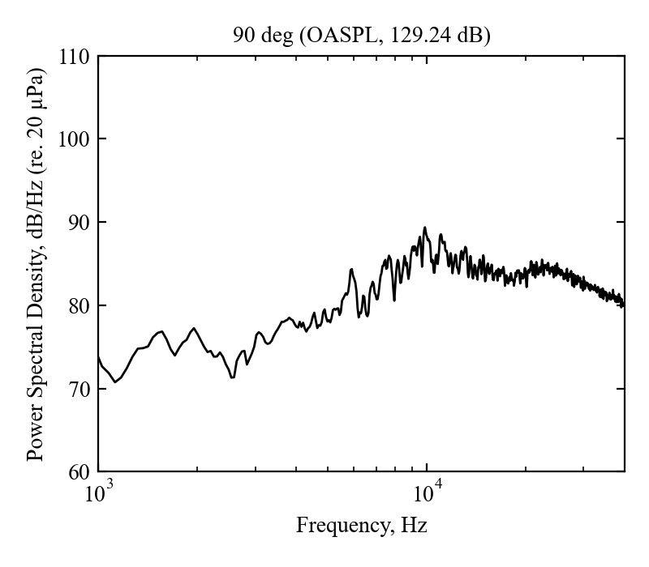

# Sound-pressure-level (SPL) spectra of a supersonic impinging jet

For more details, please see Akamine, Nakanishi, Okamoto, Teramoto, Okunuki, and Tsutsumi (2015) "Acoustic Phenomena from Correctly Expanded Supersonic Jet Impinging on Inclined Plate," *AIAA Journal* 53(7) 2061-2067, doi: [10.2514/1.J053953](https://doi.org/10.2514/1.J053953)

To use this data, please cite the paper above. Example sentences for citation are as follows:

> Akamine et al. (2015) AIAA J.. detail data available from https://github.com/wavepackets/ImpingingJetSpectra

For any questions, please send an email to akamine@thermo.t.u-tokyo.ac.jp (Corresponding author, Masahito Akamine from the University of Tokyo, Japan).

## Jet conditions
- Measurement date, November 9, 2010
	- Atmospheric pressure, $994.8 - 997.8$ hPa
	- Atmospheric temperature, $17.4 - 20.0$ ℃
	- Relative humidity, $60$%
	- Jet temperature, $33.7-37.3$ ℃
- Nozzle-exit diameter, $D = 20$ mm
- Nozzle--plate distance, $5D$
- Plate angle, $45\degree$

## Microphone conditions
- Microphone location, $r/D=40$ (distance from the intersection between the jet axis and plate)
- Microphone direction, $\theta=60 - 90\degree$ (angle from the downstream plate surface)
- Used microphone, Brüel & Kjær 1/4" free-field microphone (Type 4939), with protection grid
- Sampling frequency, 400 kHz

## Data file description (`data.csv`)
- 1st line, microphone direction
- 2nd line, Overall Sound Pressure Level (OASPL) in dB re. 20 µPa (integrated 1 kHz -- 40 kHz components)
- After 3rd line, Power Spectral Density (PSD) in dB/Hz re. 20 µPa (Frequency in Hz is shown at the 1st column)
	- As described by Akamine et al. (2015), the spectra are corrected for the microphone free-field response, atmospheric absorption, and background noise. Note that the corrections due to the latter two are negligible, less than 0.001 dB in OASPL.

Each spectrum is shown as `psd_**deg.png`.

